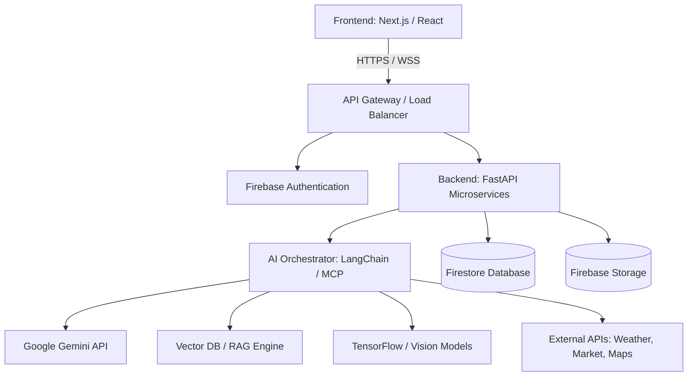

# AgriGPT – System Architecture & Design Document

## 1. High-Level Architecture Diagram



## 2. System Components

*   **Frontend (Next.js, React, Tailwind, Shadcn UI):** A single-page conversational interface. Manages chat state, renders dynamic UI blocks (charts, weather cards, product lists) via custom Markdown rendering.
*   **Backend (FastAPI, Python):** High-performance, async backend handling routing, business logic, and security.
*   **AI Orchestrator (LangChain, Gemini API, MCP):** The "brain" of the OS. Interprets user intent, plans tasks, and decides which tools/APIs to invoke.
*   **Database (Firebase Firestore):** NoSQL document database storing user profiles, farm records, chat history, and inventory.
*   **Storage (Firebase Storage):** Object storage for crop images, reports (PDF/Excel), and user uploads.

## 3. Data Flow & Request Lifecycle

1.  **User Input:** User sends a message ("Compare soybean and wheat profit") via the chat interface.
2.  **Request Handling:** The Next.js frontend sends the query to the FastAPI backend.
3.  **Intent Classification & Orchestration:** The AI Agent (powered by Gemini) analyzes the query.
4.  **Tool Execution:** The Agent identifies the need for market data and yield predictions. It executes parallel calls to the Market API and the Farm Analytics service.
5.  **Synthesis:** The Agent synthesizes the retrieved data, formats a conversational response, and constructs a JSON visual block (e.g., ````json:chart`).
6.  **Response Rendering:** The frontend parses the response, displaying the text explanation and dynamically rendering a comparison bar chart.

## 4. AI Agent Architecture (Tool-Calling)

AgriGPT relies on an **Agentic Framework** utilizing ReAct (Reasoning and Acting) principles:

*   **System Prompt:** Defines the AI as the Agriculture Copilot, instructing it on available tools and response formats.
*   **Model Context Protocol (MCP):** Standardizes how the agent interacts with external tools (Weather API, Market API, Disease Classifier).
*   **RAG (Retrieval-Augmented Generation):** Enhances the LLM with up-to-date agricultural guidelines, government schemes, and crop specifics by querying a Vector Database before answering.

## 5. Security Architecture

*   **Authentication:** Firebase Auth handles JWT token generation (Email, Google Auth).
*   **Authorization:** Role-Based Access Control (RBAC) enforced at the FastAPI middleware layer (Farmer, Expert, Admin).
*   **Data Security:** Firestore Security Rules ensure users can only access their own farm data.
*   **API Security:** All external API keys (Gemini, Maps, Weather) are stored securely in GCP Secret Manager and accessed only by the backend.

## 6. Cloud & Deployment Architecture

*   **Containerization:** Both Next.js frontend and FastAPI backend are containerized using Docker.
*   **Hosting:** Deployed to **Google Cloud Run** for serverless, auto-scaling execution (scale-to-zero capabilities).
*   **CI/CD:** GitHub Actions pipeline triggers on merge: runs tests, builds Docker images, and pushes to Google Artifact Registry, followed by Cloud Run deployment.

## 7. Folder Structure Overview

Following Clean Architecture and feature-based modularity:

```text
agrigpt/
├── frontend/                 # Next.js Application
│   ├── src/
│   │   ├── app/              # Next.js App Router (Pages & Layouts)
│   │   ├── components/       # Shared UI, Visualizers (Charts, Maps), Chat
│   │   ├── hooks/            # Custom React Hooks
│   │   ├── lib/              # Utilities, API Clients
│   │   └── types/            # TypeScript Interfaces
├── backend/                  # FastAPI Application
│   ├── app/
│   │   ├── api/              # Route Controllers
│   │   ├── core/             # Config, Security, DB Connection
│   │   ├── agents/           # LangChain Orchestration, Tool Definitions
│   │   ├── services/         # Business Logic (Weather, Market, Auth)
│   │   └── models/           # Pydantic Schemas
├── infrastructure/           # Terraform / Docker Compose files
└── docs/                     # Architecture & API Specs
```

## 8. Future Scalability

*   **Microservices Transition:** As the platform grows, individual tools (e.g., Disease Detection via TensorFlow) can be decoupled into isolated Cloud Run instances.
*   **Event-Driven Architecture:** Introduce Google Cloud Pub/Sub for asynchronous processing (e.g., generating heavy PDF reports, scheduled weather alerts, IoT sensor data ingestion).
*   **Edge Computing:** Deploy specialized, lightweight vision models directly to the user's mobile device (PWA offline capabilities) for immediate disease detection without network latency.
